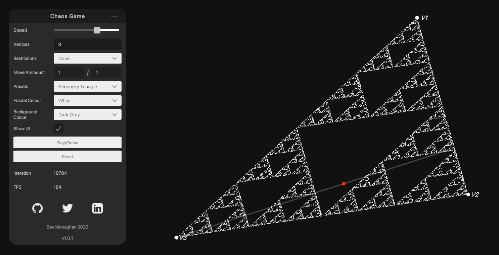

# Interactive Chaos Theory Game
 
This repo contains an interactive version of the Chaos Game created in Unity.

A deployed web version can be found here: https://www.monoganog.me/ChaosGame/

# How to use

Once open theyre a few parameters the user can select, these are: 
Ability to change the starting point location
Ability to change edge point locations
Ability to change the speed of itterations

#How to Install and Run the Project

1. Download the whole repo
2. Open Unity Hub and select "add project from disk"
3. Select the now downloaded project
4. Open the project using your Unity version of choice. (Project created in Unity 2021.3.16f

# Future Work

This project can be expanded in a number of ways, notably the use of particles and not tying itterations to the frame rate would increase number of itterations over time.

This project could also be expanded to include other rules to allow more fractal types.

# Contributions

Pull requests are welcome!

